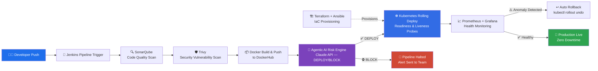

<div align="center">


</div>

<div align="center">

### 🚀 DevOps Engineer | Cloud &amp; Automation Enthusiast | ~3 Years in IT


[](https://linkedin.com/in/sumeru)
[](https://github.com/sumeru)
[](mailto:chougulesumeru19@gmail.com)
[](#)

</div>

---

## 🧭 About Me

```yaml
name: Sumeru Chougule
role: DevOps Engineer
experience: "~3 years in IT (DevOps, Cloud & Automation)"
current_company: KPIT Technologies, Pune
focus:
  - Building resilient, automated CI/CD pipelines
  - Kubernetes-native, zero-downtime deployments
  - Infrastructure as Code & DevSecOps
  - AI-augmented DevOps (Agentic CI/CD decisioning)
mission: "Ship faster. Ship safer. Automate everything."
```

I'm a **DevOps Engineer** with close to **3 years of hands-on IT experience**, specializing in designing
**secure, scalable, and highly automated cloud-native systems**. I love turning manual, error-prone
deployment processes into **self-healing, observable, one-click pipelines**. 🔧✨

- 🔭 Currently building an **Agentic AI-powered CI/CD decision engine** (DEPLOY / BLOCK with confidence scoring)
- 🌱 Deepening expertise in **GitOps, Service Mesh & Platform Engineering**
- ⚡ Reduced deployment lead time by **40%** through pipeline automation
- 🤝 Bridge between Dev and Ops — I believe in **shared ownership**, not silos
- 💬 Ask me about: `CI/CD` `Kubernetes` `Terraform` `AWS` `DevSecOps` `GitOps`

---

## 🛠️ Tech Stack &amp; Tools

<div align="center">

### ☁️ Cloud Platform


### 🐳 Containers &amp; Orchestration


### 🔁 CI/CD &amp; DevSecOps


### 🏗️ Infrastructure as Code


### 📊 Monitoring &amp; Observability


### 💻 Scripting &amp; Version Control


</div>

---

## 🏛️ CI/CD Pipeline Architecture

Here's the architecture of the **resilient, self-healing CI/CD pipeline** I built and operate at KPIT Technologies 👇



**Pipeline highlights:**
- ⚙️ **Build &amp; Scan** — Jenkins orchestrates build, SonarQube checks code quality, Trivy scans for vulnerabilities
- 🤖 **AI-Driven Risk Assessment** — Agentic AI system (Claude API) analyzes CI results and issues DEPLOY/BLOCK decisions with confidence scoring
- ☸️ **Zero-Downtime Rollout** — Kubernetes rolling deployments with readiness/liveness probes across 2+ environments
- ↩️ **Self-Healing** — Continuous health monitoring auto-triggers rollback on anomaly detection
- 🏗️ **Drift-Free Infra** — Terraform-provisioned infrastructure with remote state + DynamoDB locking

---

## 💼 Experience Snapshot

```text
🏢 KPIT Technologies, Pune
   ├── Associate Engineer                      (Jul 2025 – Present)
   │   └── CI/CD automation, K8s deployments, AI-driven deployment risk analysis
   └── Associate Trainee Engineer               (Dec 2023 – Jun 2025)
       └── AWS ETL pipelines for ADAS vehicle sensor analytics (99.9% reliability)
```

| 📌 Achievement | 📊 Impact |
|---|---|
| CI/CD pipeline automation (Jenkins + SonarQube + Trivy) | ⬇️ 40% faster deployment lead time |
| AI code review integration (GPT-4 on PRs) | ⬇️ 40% less manual review time |
| AWS Glue ETL pipeline (S3 → Redshift) | ✅ 99.9% pipeline reliability |
| Kubernetes rolling deployments | 🟢 Zero downtime across 2+ environments |
| Agile delivery | 🏃 8+ sprints, on-time feature delivery |

---

## 📊 GitHub Stats

<div align="center">


</div>

---

## 🌐 Let's Connect

<div align="center">

📍 Pune, Maharashtra, India &nbsp;|&nbsp; 📞 +91 7028244510 &nbsp;|&nbsp; ✉️ chougulesumeru19@gmail.com

[](https://linkedin.com/in/sumeru)
[](https://github.com/sumeru)

🗣️ **English** (Professional) &nbsp;•&nbsp; **Hindi** (Native) &nbsp;•&nbsp; **Marathi** (Native) &nbsp;•&nbsp; **Kannada** (Conversational)

⭐ *"Automate everything that repeats. Monitor everything that matters."*

</div>


