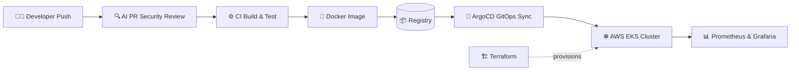
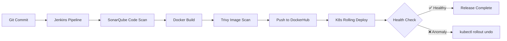

<!-- ===================== HEADER ===================== -->
<div align="center">


<a href="https://git.io/typing-svg">
  
</a>

<br/>


<br/>

[](https://linkedin.com/in/sumeru)
[](https://github.com/sumeru)
[](mailto:chougulesumeru19@gmail.com)

</div>

---

## 👋 About Me

```yaml
name: Sumeru Chougule
role: DevOps Engineer
location: Pune, India 🇮🇳
experience: 3 years
cloud: AWS ☁️
focus: [CI/CD, Kubernetes, GitOps, IaC, DevSecOps, Observability]
languages: [English, Hindi, Marathi, Kannada]
```

- 🔭 DevOps Engineer building **secure, scalable, cloud-native solutions on AWS**
- ⚙️ Skilled in **CI/CD pipelines (Jenkins, GitHub)**, **Docker & Kubernetes (EKS)**, **Terraform with remote state**, and **GitOps with ArgoCD**
- 🛡️ Hands-on with **DevSecOps** (SonarQube, Trivy) and **monitoring** (Prometheus, Grafana, CloudWatch)
- 📉 **Reduced deployment lead time by 40%** and improved developer workflow efficiency
- 🤖 Exploring **AI-assisted pull request security reviews** inside CI/CD pipelines

---

## 🛠️ Tech Stack

<div align="center">


<br/><br/>


</div>

---

## 💼 Professional Experience

<table>
<tr>
<td width="100%">

### 🟢 DevOps System Admin — Thinqloud Solutions Pvt. Ltd., Pune
`Jul 2026 – Present`

- 🔧 Built **pipeline-as-code CI/CD** for microservices with Jenkins, Git, GitHub and Docker, with email notifications for immediate developer feedback after check-in
- 🚢 Deployed containerized apps on **AWS ECS (Fargate)**: clusters, task definitions, services, VPC networking, security groups, IAM task execution roles, and CPU/memory tuning
- 🔐 Implemented **Elastic Load Balancers, CloudWatch, CloudTrail** and a dedicated **Security Management VPC** for monitoring, compliance and traffic management
- 🗓️ Managed and scheduled automated build scripts across **Dev, QA and UAT** environments
- 🧩 Broke monoliths into microservices with Docker, improving developer workflow, scalability and speed by **40%+**
- 💾 Administered networks, systems and environments; handled **data backup and disaster recovery**

</td>
</tr>
</table>

<table>
<tr>
<td width="100%">

### 🔵 Associate Engineer — Greateway Softwares Pvt. Ltd., Pune
`Jun 2025 – Jul 2026`

- 🏗️ Architected an **end-to-end CI/CD pipeline** with Jenkins, SonarQube, Trivy and DockerHub covering build, test, security scanning, artifact management and deployment
- 🔄 Developed a **zero-downtime Kubernetes rolling deployment** strategy across 2+ environments using readiness and liveness probes
- ⏪ Engineered an **auto-rollback mechanism** that monitors post-deployment health and triggers `kubectl rollout undo` on anomalies
- 📦 Authored **modular Terraform** scripts, eliminating configuration drift and enabling rapid disaster recovery
- 🤝 Collaborated with dev and ops teams to promote continuous improvement and shared ownership

</td>
</tr>
</table>

<table>
<tr>
<td width="100%">

### 🟣 Trainee Engineer — KPIT Technologies, Pune
`Dec 2023 – Jun 2025`

- 🚗 Designed an **end-to-end ETL pipeline on AWS** for ADAS vehicle sensor telemetry from a connected fleet
- 🔁 Built **AWS Glue** jobs to move sensor data from **S3 → Redshift**, achieving **99.9% pipeline reliability**
- 🔑 Managed **IAM roles and policies (least privilege)** securing Glue, S3, Redshift and CloudWatch
- 📑 Analyzed functional specs and business requirements to produce design and development deliverables
- 🏃 Delivered features on time across **8+ Agile sprints** in a cross-functional team

</td>
</tr>
</table>

---

## 🚀 Featured Project

### 🔁 GitOps-Driven CI/CD Deployment Pipeline


- 🤖 **AI-powered PR reviews** in the CI/CD pipeline scan git diffs for security vulnerabilities, **cutting manual review time by 40%**
- 🐳 Containerized app on **AWS EKS** using multi-stage Docker builds, rolling updates, **HPA** and liveness/readiness probes
- ♻️ **GitOps with ArgoCD**: self-healing and drift detection keep cluster state matching Git-defined manifests
- 🏗️ Infrastructure provisioned with **Terraform** using **remote S3 state and DynamoDB locking**


```mermaid
flowchart LR
    A[👨‍💻 Developer Push] --> B[🔍 AI PR Security Review]
    B --> C[⚙️ CI Build & Test]
    C --> D[🐳 Docker Image]
    D --> E[(📦 Registry)]
    E --> F[🔁 ArgoCD GitOps Sync]
    F --> G[☸️ AWS EKS Cluster]
    G --> H[📊 Prometheus & Grafana]
    T[🏗️ Terraform] -.provisions.-> G
```

---

## 🔄 Typical CI/CD Flow I Build


```mermaid
flowchart LR
    A[Git Commit] --> B[Jenkins Pipeline]
    B --> C[SonarQube Code Scan]
    C --> D[Docker Build]
    D --> E[Trivy Image Scan]
    E --> F[Push to DockerHub]
    F --> G[K8s Rolling Deploy]
    G --> H{Health Check}
    H -- ✅ Healthy --> I[Release Complete]
    H -- ❌ Anomaly --> J[kubectl rollout undo]
```

---

## 📈 Impact at a Glance

| 🎯 Metric | 📊 Result |
|:--|:--:|
| ⏱️ Deployment lead time | **↓ 40%** |
| 🧩 Developer workflow & speed (microservices) | **↑ 40%+** |
| 🤖 Manual PR review time (AI security scan) | **↓ 40%** |
| 🔁 ETL pipeline reliability (Glue → Redshift) | **99.9%** |
| 🏃 Agile sprints delivered on time | **8+** |
| 🚦 Deployment strategy | **Zero-downtime + Auto-rollback** |

---

## 📊 GitHub Stats

<div align="center">


<br/>


</div>

---

## 🎓 Education

🏫 **Bachelor of Technology — Electronics & Telecommunication**
Rajarambapu Institute of Technology · `Aug 2020 – Jun 2024` · **CGPA: 7.8 / 10**

## 🌐 Languages


## 🧭 Practices

`Agile/Scrum` · `SDLC` · `Disaster Recovery` · `Data Backup` · `Pipeline as Code` · `Least-Privilege IAM`

---

## 📫 Let's Connect

<div align="center">

I'm always open to discussing **DevOps, Cloud, Kubernetes, and GitOps** opportunities and ideas. 🤝

[](https://linkedin.com/in/sumeru)
[](mailto:chougulesumeru19@gmail.com)

<br/>

⭐ *If you like my work, drop a star on my repos!* ⭐


</div>
